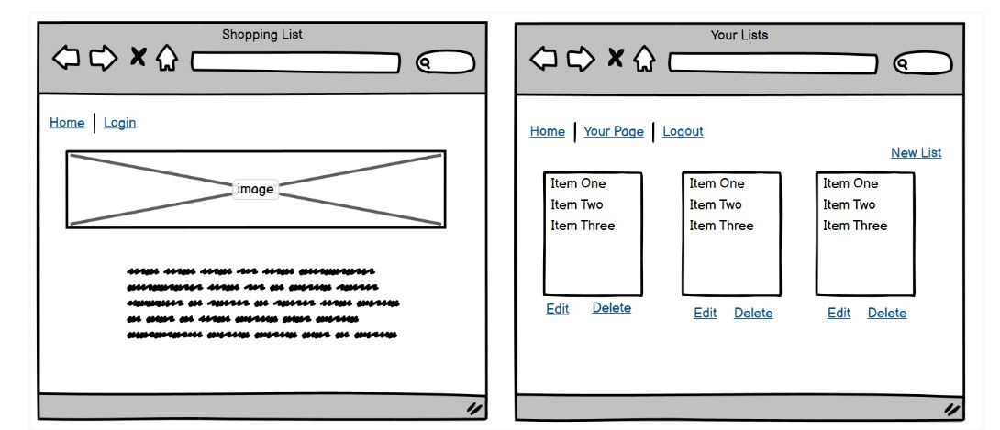

## UX Design

Theme, Epic and User Stories

The purpose of the website is for users to be able to create shopping lists when they need them. Users can create as many lists as they need, for any different purpose. Inside the list, users can specify a title, a description and a due date, as well as the individual items. Users can mark the list as complete when these items have been purchased.

The User Stories can be found in Github Projects and are displayed in the Kanban board format. Each user story has an acceptance criteria and tasks. The User Stories are:

- Account registration: As a site user I can create an account so that I can create my shopping list
- Login: As a site user I can login to my account so that I can view/edit my lists
- Create list: As a site user I can create a list so that I can see items I need to buy
- View list: As a user I can view my lists so that I can see how many lists I have and what is in them
- Edit list: As a site user I can edit my shopping lists so that I can make any necessary changes
- Delete list: As a site user I can delete my lists so that I do not have to view lists that I no longer need
- Add item: As a user I can add items to lists so that I have all items I need
- Delete item: As a user I can delete items so that lists do not contain items no longer needed

Design and layout

For the design, a colour palette was selected from coolors.co (https://coolors.co/32292f-575366-6e7dab-5762d5-d1e3dd). The idea was to keep the theme very simple, so the user can focus on the content of the page and on the content of their lists. One image is used on the homepage and the other pages just contain the necessary content.

Wireframes

The original idea was to have the lists display all on one page, with the update and delete buttons. This was changed as it would be too much information on one page when the user has multiple lists and it would get confusing trying to read all of them at once. This page now has a neat list of all of the shopping lists with just the title, description and due date. Users can click on 'see details' to get into another page that has all of the actual items and more information.

## Features

Navigation bar

Your Lists page

List Details page

Register/login/logout

Shopping lists: create, read, update, delete

Shopping list items: add and remove items

## Technologies

## Manual Testing Write-up

## Deployment

## References