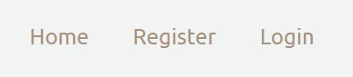
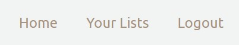

# Table of contents
1. [Welcome](#welcome)
2. [Features](#features)
    - [Navigation](#navigation)
    - [Lists Page](#listspage)
    - [List Details Page](#listdetails)
    - [Registration](#registration)
    - [Shopping lists](#shoppinglists)
    - [List items](#listitems)
    - [Header and Footer](#footer)
3. [Testing](#testing)
    - [Feature testing](#featuretesting)
    - [Validator](#validatortesting)
    - [Responsiveness](#responsivetesting)
    - [Lighthouse](#lighthousetesting)
    - [Other testing](#othertesting)
4. [Technologies](#technologies)
4. [Deployment](#deployment)
5. [Content Credits](#credits)

## UX Design

Theme, Epic and User Stories

The purpose of the website is for users to be able to create shopping lists when they need them. Users can create as many lists as they need, for any different purpose. Inside the list, users can specify a title, a description and a due date, as well as the individual items. Users can mark the list as complete when these items have been purchased.

The User Stories can be found in Github Projects and are displayed in the Kanban board format. Each user story has an acceptance criteria and tasks. The User Stories are:

- Account registration: As a site user I can create an account so that I can create my shopping list
- Login: As a site user I can login to my account so that I can view/edit my lists
- Create list: As a site user I can create a list so that I can see items I need to buy
- View list: As a user I can view my lists so that I can see how many lists I have and what is in them
- Edit list: As a site user I can edit my shopping lists so that I can make any necessary changes
- Delete list: As a site user I can delete my lists so that I do not have to view lists that I no longer need
- Add item: As a user I can add items to lists so that I have all items I need
- Delete item: As a user I can delete items so that lists do not contain items no longer needed

Design and layout

For the design, a colour palette was selected from coolors.co. The idea was to keep the theme very simple, so the user can focus on the content of the page and on the content of their lists. One image is used on the homepage and the other pages just contain the necessary content.

Wireframes

The original idea was to have the lists display all on one page, with the update and delete buttons. This was changed as it would be too much information on one page when the user has multiple lists and it would get confusing trying to read all of them at once. This page now has a neat list of all of the shopping lists with just the title, description and due date. Users can click on 'see details' to get into another page that has all of the actual items and more information.

## Features

### Navigation bar

### Your Lists page

### List Details page

### Register/login/logout

### Shopping lists: create, read, update, delete

### Shopping list items: add and remove items

### Header and Footer

## Technologies

## Testing

### Feature testing

Feature testing was done manually by going through each feature and ensuring it works as intended. Below are details of this manual testing:

Homepage

| Action        | Expected Behaviour  | Result | 
| ------------- | ------------- | ------------- | 
| Enter url of site in browser  | site shows homepage | pass | 
| Click register  | user registration page opens | pass | 
| Click login  | user login page opens | pass | 
| Submit register form | user is created | pass | 
| Submit login form | user is logged in, success message shows | pass | 
| User logs in | navigation links change to show 'logout' and 'your lists' | pass | 
| User logs out | navigation links change to show 'login' and 'register' | pass | 
| User logs out | success message shows | pass | 

Your Lists page

| Action        | Expected Behaviour  | Result | 
| ------------- | ------------- | ------------- | 
| View page  | Displays lists belonging only to logged in user | pass | 
| View page  | Completed lists show with a strike though title | pass | 
| View page  | Title, description and see details shows for all lists | pass | 
| New list button  | Form to create a new list opens with all fields | pass | 
| Submit new list form  | List is created and is added to the page | pass | 
| Click see details on any list  | Redirects to list details page (for that specific list) | pass | 

List Details page

| Action        | Expected Behaviour  | Result | 
| ------------- | ------------- | ------------- | 
| View page  | Displays details only for list clicked on | pass | 
| Edit list button  | Opens a form that allows to edit title, description, due date and complete status | pass | 
| Submit edit list form  | List details page updates with the new data | pass | 
| Mark list as complete on edit list form  | Strike appears through title on your lists page | pass | 
| Delete list button  | Opens form asking to confirm deletion | pass | 
| Confirm list deletion  | List is deleted, redirects to your lists page | pass | 
| Edit items button  |  | pass | 

### Validator testing

HTML validator testing passed (https://validator.w3.org/)
CSS validator testing passed (https://jigsaw.w3.org/css-validator/)
PEP8

### Responsiveness

### Lighthouse

### Other testing

## Deployment

## References