# Table of contents
1. [Welcome](#welcome)
2. [Features](#features)
    - [Navigation](#navigation)
    - [Lists Page](#listspage)
    - [List Details Page](#listdetails)
    - [Registration](#registration)
    - [Shopping lists](#shoppinglists)
    - [List items](#listitems)
    - [Header and Footer](#footer)
3. [Testing](#testing)
    - [Feature testing](#featuretesting)
    - [Validator](#validatortesting)
    - [Responsiveness](#responsivetesting)
    - [Lighthouse](#lighthousetesting)
    - [Other testing](#othertesting)
4. [Technologies](#technologies)
4. [Deployment](#deployment)
5. [Content Credits](#credits)

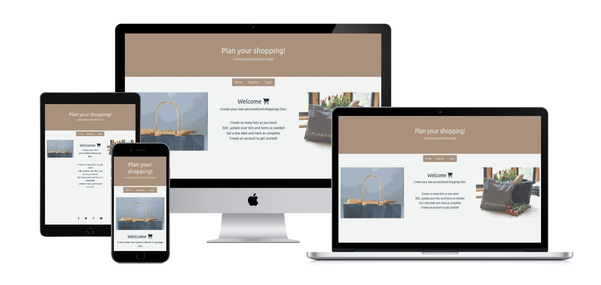

Live site link: https://pp4shoppinglist.herokuapp.com/

## UX Design

Theme, Epic and User Stories

The purpose of the website is for users to be able to create shopping lists when they need them. Users can create as many lists as they need, for any different purpose. Inside the list, users can specify a title, a description and a due date, as well as the individual items. Users can mark the list as complete when these items have been purchased.

Although the main idea is food shopping lists, the user can choose to create lists for any topic or area they require them for. The list is used by entering in a title, due date and items and then viewing the list. This is mainly targeted towards online shoppers as the lists are online, however users could also have these on a mobile device in a physical shop. Users can see all the items on the list and once they have been purchased, can mark the list as complete. The benefits of this are obviously a reminder to the user of which items they need and which type of items (by using the description and title box they can specify which type of shopping this is).

This is a useful tool for people that may need to make a lot of purchases in a short period of time, such as businesses or just people with busy lifestyles that need to be more organized. With no limit to the amount of lists, a small business could set up monthly lists of supplies that they need, or a busy person could pre-plan shopping for the month ahead by using the due date feature (create lists for each week of the month in advance).

The current strike through the title for completed lists allows users to see at a glance which lists they no longer need to pay attention to.

The site's ideal user is therefore frequent shoppers who could benefit from having more organization in their shopping experience and the site's goal is to provide that to them through the use of lists.

The User Stories can be found in Github Projects (pp4shoppinglist -> Projects -> pp4shoppinglist or https://github.com/users/caoimheD/projects/3) and are displayed in the Kanban board format. Each user story has an acceptance criteria and tasks. The User Stories with must-have criteria and that have been completed are:

- Account registration: As a site user I can create an account so that I can create my shopping list
- Login: As a site user I can login to my account so that I can view/edit my lists
- Create list: As a site user I can create a list so that I can see items I need to buy
- View list: As a user I can view my lists so that I can see how many lists I have and what is in them
- Edit list: As a site user I can edit my shopping lists so that I can make any necessary changes
- Delete list: As a site user I can delete my lists so that I do not have to view lists that I no longer need

There are other User Stories that would allow for more functionality of the website and provide a more interactive user experience, but that are not categorized as must-have. These are:

- Add item: As a user I can add items to lists so that I have all items I need (completed)
- Delete item: As a user I can delete items so that lists do not contain items no longer needed (completed)
- Duplicate lists: As a user I can duplicate lists so that if I need to purchase the same items again, I don't need to write them in again (future feature)
- Complete items: As a user I can complete individual items so that I can update the list as items are purchased (future feature)
- Search/filter lists: As a user I can filter my lists so that I only see relevant lists (future feature)

Future features

These future version features would build on the solid foundation of the website and add more complexity, for example being able to re-use a list would be helpful for shoppers who regularly purchase the same items. The search and filter options would be useful for users that have been using the site for a longer period of time and have a large number of lists. Completing items would allow for users to interact with the list while they are shopping and mark off each item as they purchase it, rather than just completing the whole list at the end.

Design and layout

For the design, a colour palette was selected from coolors.co. The idea was to keep the theme very simple, so the user can focus on the content of the page and on the content of their lists. Two images are used on the homepage and the other pages just contain the necessary content. This was a deliberate choice to keep the user's attention on the lists and content, rather than be distracted by lots of images or strong colours.

Wireframes

The original idea was to have the lists display all on one page, with the update and delete buttons. This was later changed as it would be too much information on one page when the user has multiple lists and it would get confusing trying to read all of them at once. This page now has a neat list of all of the shopping lists with just the title, description and a 'see details' link. Users can click on this 'see details' to get into another page that has all of the actual items and more information.

Data model and views

There are two models in use on this project, List and Item. The List model contains all of the relevant fields for the list (title, description, user as foreign key, due date, created date, updated date, completion status). The Item model is related to the List model through a foreign key relationship on the list field. This means that the shopping list is a foreign key to the item. The other fields are name and quantity.

Form validation was ensured by the model fields not being allowed to be 'null'. This means that for example without a title, the list cannot be created.

Class based views were used for the CRUD functionality of the lists. This was achieved by importing and using ListView, DetailView, UpdateView, CreateView, DeleteView. These are generic django views that already contain the necessary parts to perform their function (for example create or delete). With these views, it is necessary to specify the model, fields, template name and if necessary a context object name. The form is then generated on the template file with the fields specified.

The views are user specific, meaning that each logged in user can only see lists they created. For the CreateList view, 'form_valid' was used to autopopulate the 'user' field of the model with the data of the logged in user. This ensured that the user field did not appear as a dropdown box and the user could select another user as the list creator. This now works as intended, and when creating a list the user field is not visible, it will automatically populate to whatever user is logged in. The user specific views such as ShopList ensure that the logged in user only sees their lists, this was achieved by using 'get_context_data'. This successfully avoids users viewing the shopping lists of other users.

For the items view, using the Item model and the foreign key relationship, the same CreateView/DeleteView was used. The 'list' field behaves in a similar way to the 'user' field in the List model (this automatically prepopulates with the list name that is being updated, similar to how the user field is prepopulated with the logged in user data). This allows users to add and delete individual items though a button, without having to specify a list to add them to.

Adding the items to the list details page for viewing was achieved with the use of item_set. A for loop was used to loop through the detail view for the lists (listdetails) and then item_set.all displays all of the items associated with that list.

## Features

### Navigation bar

The navigation bar gives the user different options based on their logged in/out status. When users are signed out, or not yet registered, they will see the options for the homepage, to sign up or login. Once users register and/or login, the navigation bar changes to show the homepage, their lists page and a logout option. The purpose of these different navigation options is to provide a personalized experience to the user and to recognize their account status. The options presented to them are therefore relevant and useful to that specific user.

### Your Lists page

The 'your lists' page is also personalized and tailored to the specific user that is logged in. The views are user specific, meaning that only the lists that belong to the logged in user will be visible. On this page, users will see all of the lists they have created. The title, description and a 'see details' option will be shown to them. If the list has been marked as complete, the title will have a strike through it.

On this page there is an option to create a new list with the 'new list' button. This brings up a form with all fields from the list model (except user). Users can fill this out with the information that they want to have in the list. The from then redirects back to the 'your lists' page they were on and the new list will be visible there.

The date format in the 'due date' field of creating a new list is currently in YYYY-MM-DD format. This can be changed in future versions to DD-MM-YYYY. As submitting the form with the date in any other format other than YYYY-MM-DD will give an error, text has been placed in the new list form to let users know of the expected format.

### List Details page

When users click on the 'see details' link on the 'your lists' page, this will bring them into the list details page for that specific list. On this page, users can see all details related to that list such as title, description, date created, last updated, due date, complete status and items. Other than viewing, users can also take actions on this page with 3 different buttons.

The 'edit list' button brings up a form with the title, description, due date and complete status fields. Users can edit these fields and mark the list as complete, save the form and they will be redirected to the list details page which will now change to show the updates made.

The 'delete list' button will bring up a confirmation page asking if the user wants to delete the list. When this is confirmed, the list is deleted and the user is redirected to the 'your lists' page. The deleted list no longer shows there, as it has been deleted.

The 'add item' button brings up the from from the item list with the name and quantity fields. When users fill this in and submit, it redirects back to the list details page for the list they are updating, with the new item showing there.

### Register/login/logout

These options are displayed on the navigation bar. Clicking on 'register' opens a form which asks the user to select a username and password. There is an option field for an email address. Once the fields are filled in, users can then click on the 'sign up' button and this will create their account.

If users click on the 'login' option, this brings up a form where they insert their username and password. When clicking on 'sign in', they are redirected back to the homepage with the updated navigation options and will see a success message confirming they have signed in.

When users have finished their session and are ready to logout, they can use the 'logout' option on the navigation bar. They are asked to confirm if they want to logout and then have to click on the 'sign out' button to confirm this. Again, users will see a success message to confirm that they have successfully been logged out.

### Shopping lists: create, read, update, delete

The shopping lists are the purpose of the website so this is the main feature that users will interact with. As detailed in the section for the 'your lists' and 'see details' pages, there are different button options which allow the user to interact with their lists. Users have full CRUD functionality with any list they create as they can view the list, update it and delete it at any time.

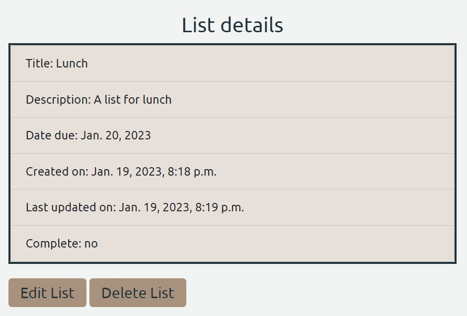

Users can mark lists as complete. When they do this, a strike appears through the list title in the your lists page and the complete part of the list details page changes from 'no' to 'yes. This means that by viewing the list details page, a user can see if the list is completed or not.

Success messages are displayed to the user when they create, edit or delete lists. This ensures that they are aware their action has been completed successfully.

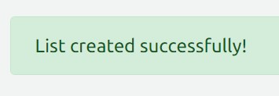

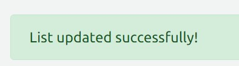

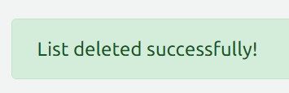

### Shopping list items: add and remove items

Items can be added through the add items button, which brings up a form with the fields from the Item model (name and quantity). When users submit the form, they are redirected back to the list details page and the new item shows under 'items'.

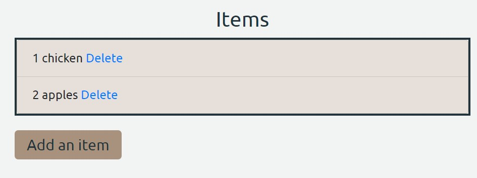

To delete items, users can click on the delete link. This brings up a confirmation page asked to confirm deletion. Once done, the item is delete and the user redirected to the list details page of the list they are viewing/updating.

In future versions of the website, the items could have their own separate page like the list details. So users would go from viewing their lists, clicking on see details to see the details of that list and then be able to click on see items within the list details page. This would then bring to a new page with just the list of items. For this version, both list details and items are displayed on the same page.

### Header and Footer

The header is a simple design with text that lets the user know what the purpose of the website is and what they can expect from the site.

The footer is again a simple design and contains links to social media sites and pages.

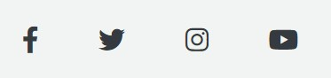

## Technologies

- Python

The following python modules were installed and used:

asgiref==3.5.2

backports.zoneinfo==0.2.1

cloudinary==1.30.0

dj-database-url==1.0.0

dj3-cloudinary-storage==0.0.6

Django==4.1.3

django-allauth==0.51.0

gunicorn==20.1.0

oauthlib==3.2.2

psycopg2==2.9.5

PyJWT==2.6.0

python3-openid==3.2.0

requests-oauthlib==1.3.1

sqlparse==0.4.3

- CSS and Bootstrap: most of the styling was done with Bootstrap, there is also a custom static css file for some smaller parts of the styling such as colours.

- HTML

- Heroku: The app and website are deployed to Heroku

- ElephantSQL: ElephantSQL was used to create and host the database.

- Fontawesome: Fontawesome was used for the different icons that are in use on the site, such as the shopping cart icon on the homepage.

- JavaScript

- Django: The website is built using django framework

- Balasmiq: used for the creation of the wireframes

- Google Fonts

## Testing

### Feature testing

Feature testing was done manually by going through each feature and ensuring it works as intended. Below are details of this manual testing:

Homepage

| Action        | Expected Behaviour  | Result | 
| ------------- | ------------- | ------------- | 
| Enter url of site in browser  | site shows homepage | pass | 
| Click register  | user registration page opens | pass | 
| Click login  | user login page opens | pass | 
| Submit register form | user is created | pass | 
| Submit login form | user is logged in, success message shows | pass | 
| User logs in | navigation links change to show 'logout' and 'your lists' | pass | 
| User logs out | navigation links change to show 'login' and 'register' | pass | 
| User logs out | success message shows | pass | 

Your Lists page

| Action        | Expected Behaviour  | Result | 
| ------------- | ------------- | ------------- | 
| View page  | Displays lists belonging only to logged in user | pass | 
| View page  | Completed lists show with a strike though title | pass | 
| View page  | Title, description and see details shows for all lists | pass | 
| New list button  | Form to create a new list opens with all fields | pass | 
| Submit new list form  | List is created and is added to the page | pass | 
| Click see details on any list  | Redirects to list details page (for that specific list) | pass | 

List Details page

| Action        | Expected Behaviour  | Result | 
| ------------- | ------------- | ------------- | 
| View page  | Displays details only for list clicked on | pass | 
| Edit list button  | Opens a form that allows to edit title, description, due date and complete status | pass | 
| Submit edit list form  | List details page updates with the new data | pass | 
| Mark list as complete on edit list form  | Strike appears through title on your lists page, completed changes to 'yes' | pass | 
| Delete list button  | Opens form asking to confirm deletion | pass | 
| Confirm list deletion  | List is deleted, redirects to your lists page | pass | 
| Add item button  | Opens form with name and quantity fields | pass | 
| Submit add item form  | Redirects to list details, new item visible | pass | 
| Delete item link  | Opens confirmation page | pass | 
| Confirm list deletion  | Item deleted, redirects to list details page | pass |

This testing covers not just the website features but also the user story testing. The above tables cover all parts of the must-have user stories (registration, login, CRUD functionality on lists)

Success messages testing/javascript testing

| Action        | Expected Behaviour  | Result | 
| ------------- | ------------- | ------------- | 
| Register/Login  | success message 'Successfully signed in as' | pass | 
| Logout  | success message 'You have signed out' | pass | 
| Create list  | success message 'List created successfully!' | pass | 
| Edit list  | success message 'List updated successfully!' | pass | 
| Delete list  | success message 'List deleted successfully!' | pass | 
| Add item  | success message 'Item created successfully!' | pass | 
| Delete item  | success message 'Item deleted successfully!' | pass | 
| Javascript timeout  | messages disappear after 3 seconds | pass | 

### Validator testing

HTML validator testing passed (https://validator.w3.org/)

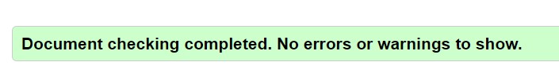

CSS validator testing passed (https://jigsaw.w3.org/css-validator/)

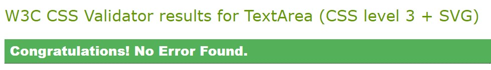

Python testing was done in Gitpod, with errors showing a red underscore and also in the 'problems' tab. These could then be easily corrected as they arose. Currently there are no issues in the 'problems' tab and no errors showing on any of the pages.

### Responsiveness

Responsiveness testing was done through Chrome developer tools, by using the options to select different devices and also manually adjust the screen size. Based on the results of these, minor changes were made to the layout to ensure it is still user friendly on all screen sizes.

Some screenshots of devices tested:

Ipad
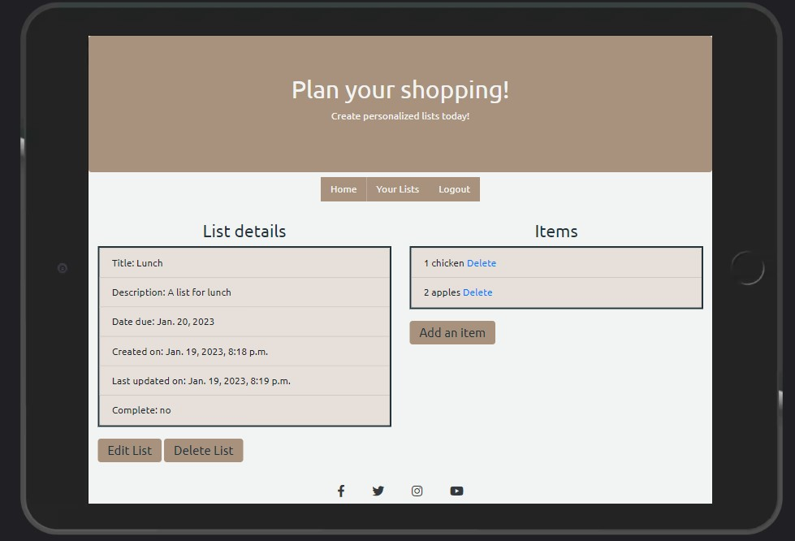

Iphone
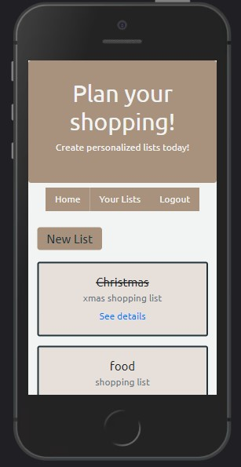

### Lighthouse

Lighthouse testing was conducted through Chrome developer tools.

### Other testing

Browsers were tested for compatibility - the live link was used in Google Chrome, Firefox and Safari. The site shows correctly in these browser types.

One automated test was conducted to test if the completed field on the List model defaults to False:

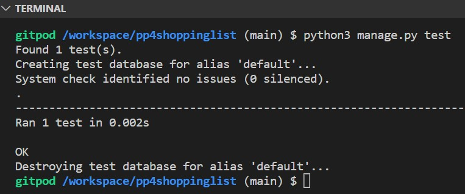

Please note that in order to replicate this test the database needs to be changed to the 'db.sqlite3' database in settings.py. The reason for this is due to a permissions issue for django to create a test database with the elephantsql one. For the test to run, the database was commented out with '#' and the sqlite one had the commented out part removed. After the test was completed, this was then switched back as the elephantsql database is the one in use for the project.

Bugs

Currently there are no known bugs on the website. 

## Deployment

This project was deployed to Heroku. A new app was created and then configured in Heroku through the 'settings' tab. These configurations are the 'config vars' which include the url to the database, secret key and PORT numbers. The database was created on ElephantSQL and this is where the database URL goes to.

The new Heroku app was then linked to the Github repository for this project and deployed using the manual deploy button in the deploy tab. 

Automatic deployments were then enabled so that any push to github would also deploy on the live Heroku app.

## References

Images are from stock image site https://unsplash.com/

Colour scheme is from coolors.co https://coolors.co/0a0908-22333b-f2f4f3-a9927d-5e503f